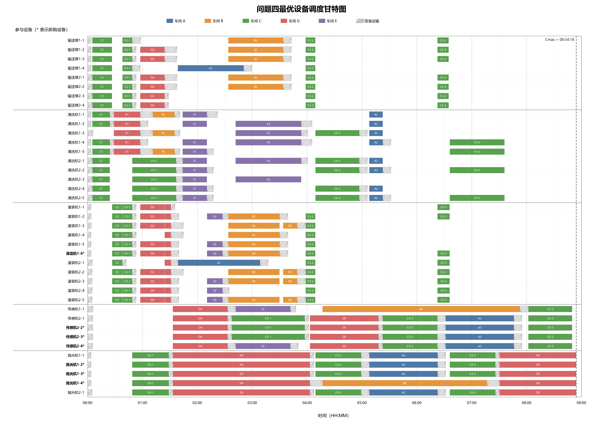

# 多工序协同作业：设备配置、跨车间调度与预算购置

围绕 B 题“多工序协同作业问题”开展的数学建模与程序求解项目。研究在工序先后关系、设备数量和跨车间运输约束下，如何安排设备协同作业，使全部任务的总完工时间最短；进一步考虑双班组协作，以及 **50万元预算下的设备购置与调度联合优化**。

仓库包含题目与附件、四个子问题的 Python 求解程序、结果表、甘特图、建模报告及 LaTeX 论文源码。方法以**关键路径分析、整数决策建模和 OR-Tools CP-SAT 求解**为主，另有模拟退火与图论方法用于交叉核对。

## 1. 四个问题的递进关系

| 问题 | 任务范围 | 相比前一步增加的困难 | 主要方法 |
|---|---|---|---|
| 问题1 | 班组1完成 A 车间 | 同型设备并联、异型设备协同 | 解析下界 + 最早开始调度 |
| 问题2 | 班组1完成 A–E 五个车间 | 多车间争用设备、设备转运与访问顺序 | 设备级 CP-SAT 精确模型 |
| 问题3 | 两个班组共同完成五个车间 | 区分设备所属班组与不同初始位置 | 双班组 CP-SAT 模型 |
| 问题4 | 双班组 + 预算内购置设备 | 同时决定购置结构、设备归属与排程 | 购置结构枚举 + 下界筛选 + 精确调度 |

核心问题不只是“每个工序用几台设备”，还包括：**具体使用哪台设备、它从哪里来、先后去哪些车间，以及何时能够开始下一项任务。**

## 2. 建模口径

以下约定决定了结果适用的范围，修改这些约定后需要重新建模与求解。

- **同型多机均分工程量：** 同一工序中，同类型设备等量分担该类型对应的工程量，并行作业。
- **异型设备协同：** 同一工序所需的不同设备类型同时开始；全部所需类型完成后，该工序才结束。
- **工序先后约束：** 各车间按给定工序链执行；重复环节在代码中展开为独立工序。
- **设备容量与不可中断：** 同一台设备不能同时服务两项作业；作业开始后不中断。
- **设备运输：** 计入从所属班组驻地到首个车间的运输，以及后续跨车间转运；移动速度取题目中的 2 m/s。
- **时间单位：** 使用整数秒，作业持续时间向上取整。

设工序 $i$ 的工程量为 $Q_i$，所需设备类型 $k$ 的单机效率为 $v_{ik}$（m³/h），投入 $n_{ik}$ 台，则该类型的作业时间为

$$
p_{ik}(n_{ik})=\left\lceil\frac{3600Q_i}{v_{ik}n_{ik}}\right\rceil.
$$

工序持续时间取各所需设备类型作业时间的最大值；主目标为最小化五个车间最终完成时刻的最大值，即总完工时间 $C_{\max}$。

问题4增加购置预算约束，并在最短总工期确定后考察最少购置费用。完整联合模型还提供固定前两层目标后的排程紧凑化步骤。

## 3. 仓库已有结果

**下面是仓库内现有论文与求解摘要报告的结果，不是本次编写 README 时重新运行全部优化得到的新结果。** 最优性结论限于上述数据、假设和模型；复跑时应以当次状态、上界、下界和校验输出为准。

| 问题 | 已记录的总完工时间 | 时:分:秒 | 记录中的依据 |
|---|---:|---:|---|
| 问题1 | 37,280 s | 10:21:20 | 可行调度达到解析下界 |
| 问题2 | 144,880 s | 40:14:40 | 主目标 `OPTIMAL`，上下界一致 |
| 问题3 | 73,575 s | 20:26:15 | 主目标 `OPTIMAL`，上下界一致 |
| 问题4 | 32,058 s | 08:54:18 | 已归档的分解求解与竞争结构下界记录 |

问题1仅涉及一个车间，不能直接与后三问的五车间工期比较。对相同五车间任务，已有记录中问题3较问题2缩短约 **49.22%**；问题4较问题3再缩短约 **56.43%**。

问题4记录的购置组合为：

| 设备类型 | 新购数量 | 分配班组 | 购置费用 |
|---|---:|---|---:|
| 精密灌装机 | 1台 | 班组1 | 35,000元 |
| 自动传感多功能机 | 3台 | 班组2 | 240,000元 |
| 高速抛光机 | 3台 | 班组1 | 225,000元 |
| **合计** | **7台** | — | **500,000元** |

结果依据：

- [问题2求解摘要](问题2/问题2_求解摘要.txt)
- [问题3求解摘要](问题3/问题3_求解摘要.txt)
- [问题4求解摘要](问题4/问题4_求解摘要.txt)
- [问题4全局最优证明明细](问题4/问题4_全局最优证明明细.txt)

### 如何理解求解状态？

- `OPTIMAL`：求解器已在当前模型下证明该目标的最优性。
- `FEASIBLE`：找到了可行解，但尚未证明该目标最优；不能仅凭文件名中的“最优”作判断。
- **主目标与次级目标要分开：** 问题3的现有摘要是“最短工期 `OPTIMAL`、紧凑化 `FEASIBLE`”，即最短工期已证明，但不能据此说紧凑化目标也已证明最优。
- **交叉核对不等于最优性证明：** 启发式算法得到相同数值可以增加一致性证据，但最优性仍需要有效下界或完整证明。

## 4. 快速开始

### 获取代码与准备环境

仓库为私有时，克隆需要具有访问权限并完成 GitHub 身份验证；也可以登录后下载 ZIP 并解压。

```bash
git clone https://github.com/lhdlw/multi-procedure-collaborative-scheduling-problem.git
cd multi-procedure-collaborative-scheduling-problem
python --version
python -m pip install ortools
```

问题2–4的精确求解脚本要求 **Python 3.10及以上、64位解释器**。建议在独立虚拟环境中安装依赖，并确认运行脚本和安装包使用的是同一个 Python。

主求解程序只额外依赖 OR-Tools；问题1及下面列出的交叉验证脚本使用 Python 标准库。当前没有依赖锁定文件，不承诺不同 OR-Tools 版本、硬件或线程设置生成完全相同的设备排程。

部分脚本保留了本机兼容解释器与 `.problem2_deps` 的查找逻辑。新环境直接使用合适的64位 Python 并安装 `ortools` 即可，无需复制这些本机路径。

**运行前请备份已有结果。问题2–4会向各自脚本所在目录写入CSV和摘要，可能覆盖同名文件。建议在单独的工作副本中复跑。**

### 问题1：先验证最简单的解析模型

在仓库根目录运行：

```bash
python "问题1/问题1_最优调度.py"
```

默认计入200秒初始运输时间，并允许同型多机并联均分。程序打印设备安排、工序时间和解析下界，并通过断言核对调度可行性及下界一致性。

可选口径（结果不可与默认口径混用）：

```bash
python "问题1/问题1_最优调度.py" --exclude-initial-transport
python "问题1/问题1_最优调度.py" --single-machine-per-type
```

### 问题2与问题3：精确调度

```bash
python "问题2/问题2_最优调度.py" --time-limit 300 --workers 1
python "问题3/问题3_最优调度.py" --time-limit 300 --refine-time 30 --workers 1
```

可添加 `--log-search` 查看搜索日志；添加 `--no-refine` 跳过主目标证明后的紧凑化优化。
问题2默认单线程，问题3默认8线程，上述命令显式使用单线程。单线程有助于重复运行比较，但不保证在给定时间内证明最优；需要时增加时限或使用多线程。

输出主要包括：设备级调度CSV、工序起止时间CSV和求解摘要；问题3还输出与题目表3对应的填报版本。

### 问题4：购置与调度

现有数据的推荐入口是分解求解程序：

```bash
python "问题4/问题4_全局最优分解求解.py" --full-time 180 --relax-time 120 --workers 8
```

其流程为：精确求解候选购置组合 → 枚举可竞争的预算极大结构 → 用工序链和累积资源松弛下界排除竞争结构 → 检查较低成本近邻。

该入口针对当前题目实例设计，包含固定候选购置向量及低成本对照结构。**修改设备价格、预算或工程量后，不能原样套用其证明结论。** 参数中的时限针对各次子问题求解，整个程序的耗时可能高于单个时限。

另有完整联合模型入口，可依次求解工期、费用和紧凑化目标：

```bash
python "问题4/问题4_预算约束下最优购置与调度.py" --time-limit 600 --cost-time 300 --refine-time 60 --workers 8
```

完整模型规模较大，可能在时限内无法证明主目标最优。若主目标未获证明，脚本会提示并停止后续阶段；如果费用阶段只返回 `FEASIBLE`，不能将该次费用称为已证明的最低费用。

问题4程序输出表4、表5、详细设备排程、工序起止时间和摘要；分解求解入口还输出证明明细。

## 5. 交叉核对

问题2、3提供不调用 OR-Tools 的贪心初解与模拟退火程序：

```bash
python "问题2/问题2_模拟退火交叉验证.py" --iterations 30000 --restarts 2 --seed 20260820
python "问题3/问题3_模拟退火交叉验证.py" --iterations 30000 --restarts 2 --seed 20260820
```

以上是缩短的演示预算，不保证达到精确模型记录的结果。脚本在控制台打印搜索结果，不自动生成结果CSV。其代码保留了已知精确目标值作为比较与提前停止条件，因此不是不知道参考答案的盲测。

问题4可从已有设备排程构造工序先后边、设备运输边及作业持续时间边，通过拓扑排序与DAG最长路重新计算最早完成时刻：

```bash
python "问题4/问题4_关键路径法独立交叉验证.py"
```

该脚本读取同目录的 `问题4_最优设备调度方案.csv`。它核对给定设备选择与访问顺序下的约束、费用和时间一致性，**不独立搜索全部购置方案，也不单独证明全局最优**。

## 6. 结果展示与材料导航



上图是仓库已归档方案的展示。仅运行求解脚本不会自动重绘该图片，也不会自动更新Word报告或论文中的表格；修改数据或重新求解后，应检查这些材料是否同步。

建议阅读顺序：

1. 题目与附件：根目录的题目Word文件、两份Excel附件。
2. [问题1解析求解](问题1/问题1_最优调度.py)：理解并联时长与下界。
3. [问题3建模过程与最终方案](问题3/问题3_数学建模过程与最终方案.md)：理解双班组设备级调度。
4. [问题4建模过程与最终方案](问题4/问题4_数学建模过程与最终方案.md)：理解预算与调度的联合决策。
5. [论文LaTeX源码](B题_多工序协同作业_论文.tex)：阅读完整模型、公式与结果分析。

```text
.
├── B-attachment.xlsx / B-附件.xlsx      两份原始附件材料
├── B题 多工序协同作业问题(2).docx      题目文档
├── B题_多工序协同作业_论文.tex         完整论文源码
├── 问题1/                            解析求解、报告与图示
├── 问题2/                            单班组精确调度、模拟退火及结果
├── 问题3/                            双班组精确调度、交叉验证及结果
├── 问题4/                            预算购置、分解求解、图论核对及结果
└── 修改记录.md / 修改记录_详细.txt     论文修改记录
```

当前主要求解程序直接在Python中定义工序、设备效率、距离、数量和价格，**不是运行时自动读取Excel**。更换附件不会自动改变模型；需要同步修改各求解与交叉验证程序中的数据定义，并重新核对一致性。两份附件也不应在未经比对的情况下视作同一文件。

### 编译论文（可选）

需要安装含中文支持的 TeX 环境，在仓库根目录使用 XeLaTeX：

```bash
xelatex -interaction=nonstopmode "B题_多工序协同作业_论文.tex"
xelatex -interaction=nonstopmode "B题_多工序协同作业_论文.tex"
```

保留问题1–4目录中的图片及原有相对路径。论文编译与优化求解是两个独立步骤，不会相互自动更新。

## 7. 使用边界

- 本仓库展示当前题目实例的建模与求解过程，不是面向任意生产场景的通用调度系统。
- 工程量、速度和效率均按确定值处理；未建模设备故障、随机加工时间、交接班或动态订单等实际因素。
- 数值相同不代表设备编号、访问顺序和非关键工序起止时刻必须完全相同，最优排程可能不唯一。
- 修改模型后，应同时检查求解状态、有效下界、设备不重叠、运输时间、工序链及预算，而不能只看最终工期。
- 本次README依据已有源码、论文和结果文件整理，未重新完成所有长时限求解与论文编译验证。
